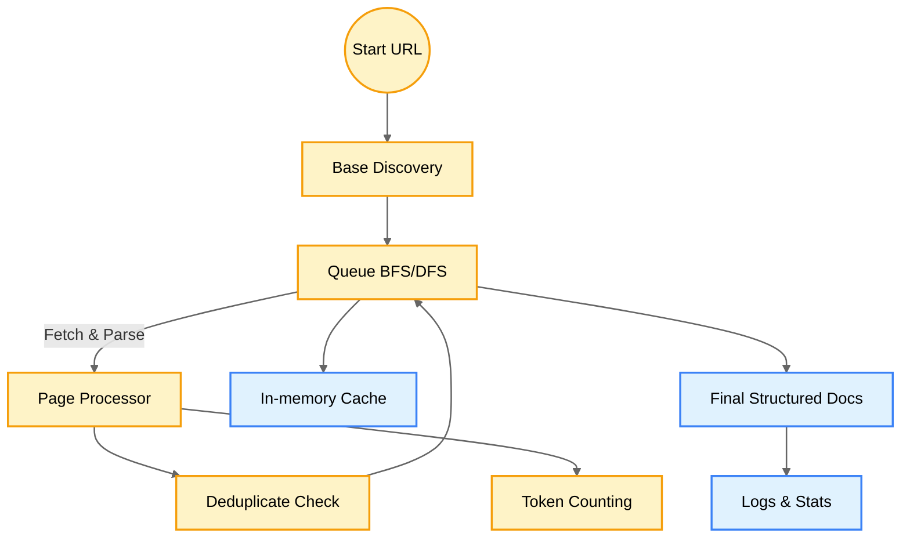
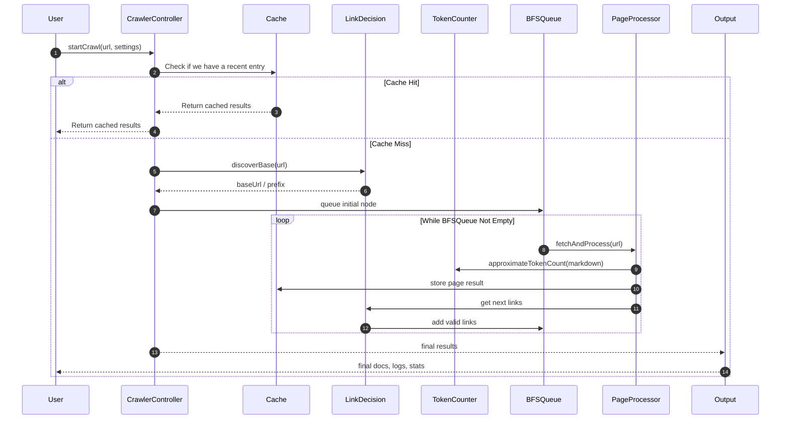

# 🍝 DocsPasta Re-architecture Plan

DocsPasta is intended to be a modern, general-purpose documentation crawler.  
It indexes large sets of docs pages for use in AI (LLM) contexts, enabling more robust and up-to-date knowledge ingestion.

---

## 1. Context

- **Use Case**: Provide an easy way to crawl documentation for any library or framework, format it into Markdown or other AI-friendly outputs, and serve it or feed it to LLMs with minimal manual overhead.
- **Pain Points**:
  - Copy/pasting entire docs by hand is frustrating.
  - LLM knowledge cutoff means new or obscure projects are unknown to them.
  - Some documentation is large and has deeply-nested or multi-part structures that are painful to navigate manually.
- **Goal**:
  - A robust crawler that can parse, deduplicate, and store documentation in a manageable format.
  - Provide the resulting content in a variety of formats (Markdown, plain text, etc.).
  - Offer stats on tokens, enabling chunking or gating logic before sending to an LLM.

---

## 2. Current Version Overview

The existing system:
1. **Entry Point**: Provide a `startUrl`.
2. **Depth-based BFS**: Recursively follow links up to `maxDepth`.
3. **Content Extraction**: Strips away `nav`, `header`, `footer` if configured, transforms HTML → Markdown.
4. **Caching**: Simple in-memory for repeated runs.
5. **Deduplication**: Basic text-based hashing to detect identical content.
6. **Rate Limiting & Concurrency**: p-queue used to manage request concurrency.

**Shortcomings**:
- Inflexible logic for deciding which links to follow (only checks domain or not).
- If user starts deep (e.g. `docs.example.com/foo`), it might miss the rest of the docs (like `docs.example.com/bar`).
- No concept of a “prefix” or “root path” for the docs.  
- Does not compute or store approximate token usage for each page.  
- Logging is basic (helpful, but can be expanded).  
- Some repeated or “boring” pages might get crawled anyway.

---

## 3. Proposed Re-architecture

### 3.1 Overview

Instead of purely a depth-based BFS, we introduce:
- **Initial Base Discovery**: Identify the root or “prefix” from `startUrl`. E.g., if `startUrl` is `docs.example.com/path/subpath`, we attempt to discover or define a broader “base prefix” (like `docs.example.com/path`) so we can also climb “up” or “over” if we detect it. (This can be set with a user override or discovered automatically.)
- **Domain Restriction**: We continue to limit to the same domain unless explicitly allowed to go to external docs.
- **Refined BFS/DFS Hybrid**: 
  1. We track each discovered link.  
  2. If it’s in-domain and not yet visited, we check if it matches the user-defined prefix rules.  
  3. We also unify the notion of “maxDepth” with a “maxDistance” from the discovered base path, which can be a BFS technique.
- **Token Counting**: Each page gets an approximate token count. Summing the total tokens helps us decide how big the final doc set is. Possibly we chunk large docs automatically in future expansions.
- **Better Logging**: Provide structured logs for each step (fetch, parse, deduplicate, store, skip).
- **Revised Deduping**: Optionally store partial “similarity” metrics. For now, we still do a simple hash-based approach, but with improved logging and an easier path to expand to partial or fuzzy dedup.

### 3.2 Architecture Components

1. **CrawlerController**: The main entry for a crawl run.  
2. **CrawlerQueue** (via p-queue): Manages concurrency, rate limiting, scheduling.  
3. **Base URL Discovery**: A function that, given a `startUrl`, tries to figure out a “root path” for that doc site. 
4. **Link Decision**: A robust function that checks domain, prefix, file extensions, etc.  
5. **PageProcessor**: Summarizes content extraction, code block formatting, dedup checks, token counting.  
6. **Cache**: In-memory or persistent store for pages.  
7. **Stats/Logs**: Store BFS progress, token usage, etc.

### 3.3 High-level Diagram

### 3.4 Detailed Flow

## 4. Key Components

1. **`CrawlerController`**
    - Orchestrates the entire crawl.
    - Exposes a single `crawl()` method.
2. **`LinkDecision`**
    - Logic for determining if a link is in scope (same domain, matches prefix, not skipping certain patterns).
3. **`PageProcessor`**
    - Fetch page → parse HTML → remove nav, header, footers → convert to Markdown → approximate tokens.
4. **`TokenCounter`**
    - Simple method to estimate tokens from a string. In future, integrate GPT tokenizer or similar.
5. **`Cache`**
    - In-memory (for now) with versioning, time-based expiration.
6. **`Stats/Logging`**
    - Every step logs info.
    - Summarize final stats (#pages, total tokens, new links found, etc.).

---

## 5. Conclusion

This re-architecture ensures:

- We can climb from a deep link up to the “root” doc path.
- We track tokens for each page.
- We have robust BFS, concurrency, logging, stats.
- The system is flexible enough to handle most doc site structures.
