# 📚 Docspasta - Proposed Architecture

## 1. Context

Docspasta aims to crawl and harvest relevant documentation pages for integration into LLM contexts. In addition, it must handle:

- **Domain or Subpath Scoping** to stay within the relevant portion of a site
- **Depth Control** to avoid going too deep (and to limit extraneous data)
- **De-duplication** to handle duplicate content
- **Pre-Processing** to strip away non-essential elements (headers, footers, nav bars, etc.)
- **Caching** to avoid re-fetching identical content
- **Statistics Gathering** like token counting, number of pages visited, time spent, etc.

## 2. Current Version (Simplified Overview)

| **DocumentationCrawler** | **Description**              |
| ------------------------ | ---------------------------- |
| `fetchWithRetry()`       | Fetches HTML with retries    |
| `extractLinks()`         | Finds links in `<a href="">` |
| `extractContent()`       | Picks `<main>` or `<body>`   |
| `turndownService`        | Converts HTML to Markdown    |
| Concurrency              | Via `p-queue`                |
| Caching layer            | Implements caching mechanism |

### Shortcomings

- We do not robustly handle **path constraints** (e.g. user only wants to crawl `/docs/` subpath).
- We do not handle **domain or subdomain** scoping in a deeply flexible way (some docs might live at `docs.example.com` or `example.com/docs`).
- De-dup is simplistic (hash-based). We might want a more robust approach eventually, but for now hashing is okay.
- We lack a built-in **token counting** approach.
- Logging & stats are scattered. We want a more uniform approach.

## 3. Proposed Re-Architecture

### High-Level Idea

1. **Crawler**: A central class that orchestrates the entire crawl.  
2. **Link Strategy**: Customizable logic for determining if a link stays in scope:
   - By domain or subdomain
   - By path prefix or route
   - By extension filtering (like `.pdf`, `.png` -> skip)
3. **Content Pipeline**
   - HTML fetch -> parse -> remove undesired elements -> code block formatting -> markdown -> optional token counting
4. **Caching**
   - Use a versioned in-memory (or file-based) cache for entire crawl results + individual pages 
5. **Logging & Stats**
   - Each step logs to console or file
   - After each page is processed, store partial stats
   - Provide final summary stats (pages visited, total tokens, etc.)

### Example Flow

### Shortcomings

- We do not robustly handle **path constraints** (e.g. user only wants to crawl `/docs/` subpath).
- We do not handle **domain or subdomain** scoping in a deeply flexible way (some docs might live at `docs.example.com` or `example.com/docs`).
- De-dup is simplistic (hash-based). We might want a more robust approach eventually, but for now hashing is okay.
- We lack a built-in **token counting** approach.
- Logging & stats are scattered. We want a more uniform approach.

## 3. Proposed Re-Architecture

### High-Level Idea

1. **Crawler**: A central class that orchestrates the entire crawl.  
2. **Link Strategy**: Customizable logic for determining if a link stays in scope:
   - By domain or subdomain
   - By path prefix or route
   - By extension filtering (like `.pdf`, `.png` -> skip)
3. **Content Pipeline**: 
   - HTML fetch -> parse -> remove undesired elements -> code block formatting -> markdown -> optional token counting
4. **Caching**:
   - Use a versioned in-memory (or file-based) cache for entire crawl results + individual pages 
5. **Logging & Stats**:
   - Each step logs to console or file
   - After each page is processed, store partial stats
   - Provide final summary stats (pages visited, total tokens, etc.)

### Example Flow



```mermaid
flowchart LR
    subgraph Crawler Lifecycle
        A["Init Crawler"] --> B["Queue Start URL"]
        B --> C["processUrl(node)"]
        C --> D["fetchWithRetry()"]
        D --> E["extractContent()"]
        E --> F["Turndown → Markdown"]
        F --> G["Duplicate Check → Hash"]
        G --> H["Extract Links"]
        H --> I["Queue Child Links"]
        I --> J["Update Stats & On-Progress"]
        J --> K["End? → Return Results"]
        K --> A
    end
```

### Detailed Domain / Path Scope

We can define an option like:

```ts
interface CrawlScope {
  domain?: string;      // e.g. "docs.example.com"
  subpath?: string;     // e.g. "/docs"
  allowSubdomains?: boolean;
}

```

Then we filter each discovered link by comparing it to the scope rules.

### Token Counting (Optional)

Include a lightweight function:

```ts
function approximateTokenCount(text: string): number {
  // A naive approach: assume ~4 chars/token
  return Math.ceil(text.split(/\s+/).join('').length / 4);
}

```

Or integrate an existing open-source library. This step is optional but beneficial for advanced stats.

## 4. Key Components

1. **DocumentationCrawler**: Orchestrates everything.
2. **CrawlerOptions** & **CrawlScope**: Fine-grained user controls.
3. **Cache**: In-memory version or extensible backend.
4. **Logger**: Consistent logging for dev/debug.
5. **Stats**: Aggregates pages visited, time spent, total tokens, etc.

## 5. Architecture Diagram


**This approach** ensures we respect domain/path constraints, avoid repeated pages, gather robust stats, and produce final content suitable for LLM use.

---

## 6. New Version Plan (Summary)

1. **Add** `crawlScope` or `domainFilter` + `subpathFilter` to `CrawlerOptions`.
2. **Filter** links in `extractLinks` so that only domain + subpath + file extension pass.
3. **Optionally** add a `tokenCount` to each `PageResult`.
4. **Consolidate** logging with a new logger utility or keep the pattern but add more structured logs.
5. **Finish** the final stats by including total tokens, total pages, total time, etc.
