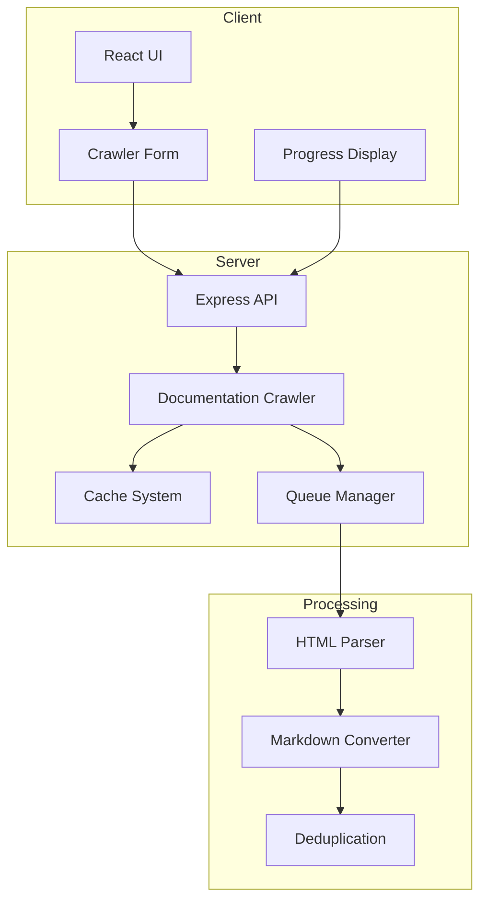
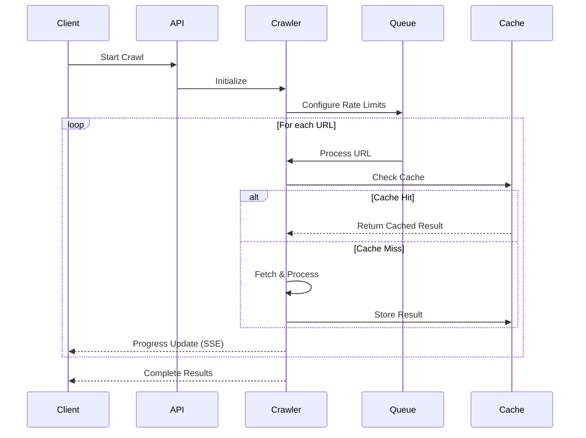
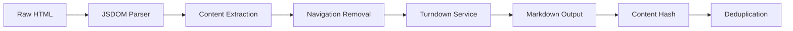

**# 🍝 DocsPasta

A modern documentation crawler and processor that makes documentation searchable and accessible. DocsPasta intelligently crawls, processes, and organizes documentation from various sources, making it easier to find and use the information you need.

## 🚀 Quick Start

```bash
# Install dependencies
npm install

# Start development server
npm run dev

# Run tests
npm test
```

## 🎯 Features

- 🕷️ **Smart Documentation Crawler**
  - Intelligent content extraction
  - Duplicate detection
  - Rate limiting and concurrency control
  - Progress tracking and error handling

- 📝 **Content Processing**
  - HTML to Markdown conversion
  - Code block preservation
  - Metadata extraction
  - Content deduplication

- 🔄 **Real-time Updates**
  - Server-Sent Events (SSE) for progress
  - Live status reporting
  - Error tracking

## 🏗️ Architecture



## 🛠️ Tech Stack

- **Frontend**
  - Next.js 15 (App Router)
  - React 19
  - TypeScript
  - Tailwind CSS
  - Shadcn UI
  - Radix UI

- **Backend**
  - Node.js
  - Express.js
  - TypeScript
  - JSDOM
  - Turndown

- **Database**
  - Supabase (PostgreSQL)
  - Supabase Auth
  - Supabase Realtime

- **Testing**
  - Vitest
  - MSW (Mock Service Worker)

## 📋 Implementation Details

### Crawler System

The crawler is built around three main components:

1. **Queue Management**


2. **Content Processing Pipeline**


3. **Caching Strategy**
- Version-aware caching
- Content-based invalidation
- Request deduplication
- Memory optimization

### API Endpoints

- `POST /api/crawl`
  - Start a new crawl
  - Supports SSE for progress updates
  - Configurable options

- `GET /api/crawl/:id/status`
  - Check crawl status
  - Get progress metrics

## 🧪 Testing

```bash
# Run all tests
npm test

# Watch mode
npm run test:watch

# Coverage report
npm run test:coverage

# Visual test UI
npm run test:ui
```

## 📚 Documentation

- [AI Development Guide](./AI.md)
- [Architecture Decisions](./docs/ai-notes/topics/decisions/)
- [Feature Documentation](./docs/ai-notes/topics/features/)
- [Development Status](./docs/ai-notes/topics/features/crawler-development-status.md)

## 🤝 Contributing

1. Read the [AI.md](./AI.md) guide
2. Check `.docs/ai-notes/` for templates and guidelines
3. Follow our documentation system for consistency
4. Submit PRs with comprehensive documentation

## 📄 License

MIT License - see [LICENSE](./LICENSE) for details **